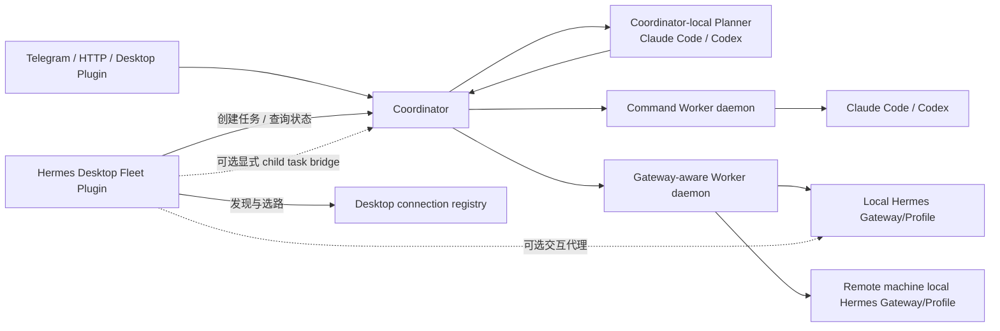

# Hermes 两阶段编排与 Hermes Desktop 多 Gateway 融合改造方案

## 1. 结论

项目可以完成，且不需要推翻当前已经实现的两阶段编排。

推荐架构是：

- **Coordinator** 继续作为任务、计划、路由约束、租约、重试、取消、结果和通知的唯一事实源。
- **后台 Worker daemon** 继续承担生产执行；它可以调用本机 Claude Code、Codex 或本机 Hermes Gateway/Profile。
- **Hermes Desktop** 复用其成熟的多 Gateway 注册、Profile 发现、精确路由和交互能力，作为 fleet 控制面，而不是任务队列或生产调度器。
- **Desktop Fleet Plugin** 提供可视化选路、任务创建和状态观察；它可通过 `host.profileRoutes()`、`host.requestProfile()` 与指定 `(connectionId, profile)` 交互。
- **Desktop Bridge** 只作为后续可选能力，用于显式跨 Gateway delegation；所有 delegation 必须转化为 Coordinator 中可审计的 child task。

最重要的技术边界是：Hermes Desktop Plugin SDK 的 `host.profileRoutes()`、`host.requestProfile()`、`host.connections()`、`host.agents()` 运行在 Desktop 插件宿主中。生产主链路不能假设这些接口在无 GUI 环境中可用，也不能要求 Desktop 常驻。

## 2. 当前实现基线

当前工作区已经具备：

- Telegram/API 创建任务。
- 主控 Codex 使用 `codex-with-chatgpt` Skill 规划，Coordinator 只提供规划协议与持久化。
- `planning_pending -> planning -> pending -> claimed -> running -> terminal` 状态机。
- SQLite 持久化 `plan`、`execution_prompt`、Planner lease、Worker lease、重试和取消。
- `target_worker_id` 定向 Worker。
- `execution_agent` 显式指定 Claude/Codex 等执行器。
- `execution_agent` 为空时，由领取任务的 Worker 使用自己的默认 Agent。
- HMAC、nonce、防重放、通知 outbox 和离线 E2E。

这些能力应被保留，新增改造集中在“路由身份”“Worker 可暴露的 Gateway/Profile 路由”和“Desktop 控制面”。

## 3. 目标架构



### 3.1 Coordinator

职责保持集中：

- 接收用户任务和幂等键。
- 选择 Planner，持久化计划与执行提示词。
- 保存用户路由约束和每次执行的解析结果。
- 原子 claim、lease、attempt、retry、cancel、terminal result。
- 维护 Worker/route 最近注册视图。
- 验证 delegation、创建 child task。
- 不保存 Gateway、SSH、Cloud 或 Desktop 凭据。

### 3.2 Command Worker daemon

这是当前 Worker 的兼容形态：

- 在目标开发机器后台运行。
- 默认执行本机配置的 Agent。
- 用户指定 `execution_agent` 时，只在 Worker 宣告支持后领取。
- 继续使用固定 argv 和 `create_subprocess_exec`，禁止 shell 拼接。

### 3.3 Gateway-aware Worker daemon

生产环境推荐在每台 Worker/Gateway 机器运行，而不是从 Coordinator 机器通过 Desktop GUI 远程代跑：

- 注册本机可执行的 Hermes Profile 和 Agent 能力。
- 将 Coordinator 任务映射到本机 Hermes Gateway/Profile。
- 按 `(gateway_id, profile)` 隔离 session/client。
- 通过本机 Hermes API/CLI 执行任务。
- 继续使用 Coordinator 的 claim、heartbeat、cancel、result 协议。
- 不持有独立重试队列；失去 lease 后不得自行重跑。

### 3.4 Hermes Desktop Fleet Plugin

复用 Desktop 已成熟的能力：

- `host.connections()`：列出 Gateway 标签、类型和 Primary，不读取 Token。
- `host.agents()`：显示每个 `(gateway, profile)` Agent。
- `host.profileRoutes()`：获得精确 registry route。
- `host.requestProfile(route, ...)`：不切换前台即可与指定 route 交互。
- `host.warmAgent()`：交互前预热。

插件职责：

- 展示 fleet、Worker 在线状态和 Coordinator route 映射。
- 让用户选择 Gateway/Profile/Executor 后创建任务。
- 查询任务计划、attempt、运行状态和结果。
- 可提供个人工作站模式的“Desktop Proxy Executor”，但必须明确标记为非生产能力；Desktop 关闭后其 lease 自然过期。

插件不得：

- 直接修改任务终态。
- 维护第二套 claim/retry/cancel 状态机。
- 从 `connections.json` 读取或复制凭据。
- 依据当前 GUI 激活的 Gateway/Profile 隐式决定任务路由。

## 4. 身份与术语

不要再把 Hermes Profile、Claude/Codex 和 Worker 都称为 `agent`。

| 字段 | 含义 |
| --- | --- |
| `worker_id` | 领取 Coordinator lease 的后台执行进程/机器身份 |
| `gateway_id` | Coordinator 侧稳定的 Hermes Gateway 身份 |
| `profile` | Gateway 中的 Hermes Profile |
| `execution_agent` | Claude、Codex、Hermes-native 等实际执行器 |
| `desktop_source_id` | 可选，某个 Desktop fleet registry/bridge 身份 |
| `desktop_connection_id` | 仅在该 Desktop registry 内有效的 `connectionId` |
| `route_id` | Coordinator 分配的稳定路由记录 ID |
| `remote_run_id` | 下游 Gateway 运行标识，用于取消和恢复 |

Desktop `connectionId` 是 registry 路由身份，应与 Profile 配对使用；它不应被假定为跨所有 Desktop 安装全局唯一。Coordinator 使用自己的 `gateway_id/route_id`，Desktop 插件维护：

```text
(desktop_source_id, desktop_connection_id, profile)
    -> coordinator route_id
    -> (worker_id, gateway_id, profile)
```

若 Hermes Gateway 暴露稳定 install ID，可将其作为 `gateway_id`；否则由 Coordinator enrollment 生成并持久化。

## 5. 路由模型

### 5.1 用户请求约束

在 `TaskCreate` 增加：

```text
target_worker_id: Optional[str]        # 保留现有字段
target_gateway_id: Optional[str]
target_profile: Optional[str]
execution_agent: Optional[str]
```

规则：

- `target_gateway_id` 和 `target_profile` 第一版必须同时出现或同时为空。
- 用户显式约束是硬约束，Planner 和 Worker 均不能覆盖。
- exact Gateway/Profile 不在线时，任务保持 `pending` 并显示不可路由原因，不回退到其他 Profile。
- 只指定 `execution_agent` 时，任意支持该 Agent 的兼容 Worker 可领取。
- 全部为空时，保持当前语义：普通 Worker 按现有规则领取，并使用自己的默认 Agent。

### 5.2 Worker 注册路由

新增明确模型，避免继续把路由塞进自由格式 `metadata`：

```text
WorkerRoute:
  route_id
  worker_id
  gateway_id
  profile
  target_profile          # Desktop route alias 与后端 Profile 不同的情况
  gateway_kind            # local|remote|ssh|cloud
  supported_agents[]
  default_agent
  labels{}                # 非敏感
  last_seen_at
```

现有 Command Worker 注册一个无 Gateway 的 command route；Gateway-aware Worker 注册一个或多个 Gateway/Profile route。

### 5.3 Claim 解析顺序

Coordinator 仅在所有硬约束匹配时允许 claim：

1. `target_worker_id`。
2. `target_gateway_id + target_profile`。
3. `execution_agent`。
4. Worker 并发、在线和 lease 条件。

claim 成功时原子持久化：

```text
resolved_worker_id
resolved_route_id
resolved_gateway_id
resolved_profile
resolved_execution_agent
attempt_count
lease_expires_at
```

用户没有指定 Agent 时，取该 Worker route 注册的 `default_agent` 并持久化。这仍然是“Worker 使用自己的默认 Agent”，但执行记录变得可审计。

每次 attempt 内 resolved route 不可变。lease 过期重试时：

- 用户 exact route 仍保持 exact。
- 非 exact 任务可由另一个兼容 Worker 领取。
- 清理上次 attempt 的 resolved 字段，但保留 request constraint。

## 6. 数据库改造

全部使用 additive migration，不重写已有任务。

### 6.1 `tasks` 新增列

```sql
target_gateway_id TEXT
target_profile TEXT
resolved_route_id TEXT
resolved_gateway_id TEXT
resolved_profile TEXT
resolved_execution_agent TEXT
remote_run_id TEXT
remote_session_id TEXT
parent_task_id TEXT               -- M4
delegation_depth INTEGER DEFAULT 0 -- M4
delegation_key TEXT               -- M4
```

保留 `target_worker_id`、`claimed_by`、`execution_agent`，避免破坏当前 API 和 SQLite 数据。

### 6.2 新增 `worker_routes`

推荐使用标准表，而不是 `routes_json`，便于 SQLite 做确定性匹配和唯一约束：

```sql
worker_routes(
  route_id TEXT PRIMARY KEY,
  worker_id TEXT NOT NULL,
  gateway_id TEXT,
  profile TEXT,
  target_profile TEXT,
  gateway_kind TEXT NOT NULL,
  supported_agents_json TEXT NOT NULL,
  default_agent TEXT NOT NULL,
  labels_json TEXT NOT NULL,
  last_seen_at REAL NOT NULL,
  UNIQUE(worker_id, gateway_id, profile)
)
```

### 6.3 `task_attempts`（M3）

当允许非 exact 任务在重试时切换 Worker/Gateway 后，应引入 attempt 审计表，记录每次实际执行位置和结果。M0/M1 可先在 `tasks` 保存当前 resolved route，M3 再增加完整历史。

## 7. API 改造

### 7.1 Director API

`POST /api/v1/tasks` 增加上述路由约束。校验：

- Gateway/Profile 成对。
- `target_worker_id` 必须与 exact route 的注册归属兼容。
- Planner 的 route hint 不能越过用户约束。
- 老请求无需修改。

`GET /api/v1/tasks/{id}` 增加 request/resolved route、`remote_run_id` 和不可路由诊断。

### 7.2 Worker API

第一阶段继续复用 `/api/v1/workers/*`：

- 注册 payload 增加 `routes` 和 `default_agent`。
- heartbeat 可更新 route snapshot。
- claim response 返回 resolved route。
- start/result 请求必须继续验证 claim owner 和 lease。

待兼容版本稳定后再考虑 `/api/v2/executors/*`，不要因命名一次性破坏现有 Worker。

### 7.3 Fleet 查询 API

新增 `GET /api/v1/routes`，供 Telegram 和 Desktop Plugin 使用，返回：

- Worker/Gateway/Profile/Agent 的非敏感视图。
- online/stale 派生状态。
- exact route 当前不可用原因。

### 7.4 Optional delegation API（M4）

```text
POST /api/v1/tasks/{parent_task_id}/delegations
```

请求包含 sub-plan/prompt、exact route、execution Agent 和 `idempotency_key`。Coordinator 验证父任务 owner、scope、depth 和唯一键，随后创建一等 child task。

## 8. Telegram 交互

推荐语法：

```text
/new --planner codex-with-chatgpt \
     --gateway homelab \
     --profile architect \
     --executor codex \
     <任务>
```

兼容规则：

- 当前 `--agent` 保留为 `--executor` 的兼容别名。
- `--executor` 不提供时，由最终 Worker 使用自己的默认 Agent。
- `--gateway` 与 `--profile` 必须一起出现。
- 可继续使用 `target_worker_id` 的 API 定向方式。
- `/agents` 后续改为 `/routes` 或同时显示 Worker、Gateway、Profile、默认/支持 Agent。

## 9. 状态机、幂等和恢复

Gateway 只是执行 transport，不新增 `gateway_*` TaskStatus：

```text
planning_pending -> planning -> pending -> claimed -> running
                                             |          |
                                             +----------+-> succeeded|failed|timed_out|cancelled
```

关键规则：

- claim 原子写 owner、attempt、resolved route 和 lease。
- stale/late result 必须因 owner/lease 不匹配被拒绝。
- Gateway 下游请求使用 `task_id:attempt_count` 作为 idempotency key。
- 保存 `remote_run_id/remote_session_id`，用于 cancel 和 restart reconciliation。
- 下游不支持幂等或状态查询时，lease retry 可能导致实际重复执行；M1 上线前必须明确接受该风险或实现 adapter reconciliation。
- Worker 重启后重新注册，但不能凭本地历史自行重跑；始终先向 Coordinator 核对当前 attempt。
- Profile 删除/改名视为 route 消失，不自动重定向 exact task。
- Desktop Proxy Executor 退出后不做特殊恢复，按普通 Worker lease 失效处理。

## 10. 凭据边界

Coordinator 只保存：

- Director/Worker/Bridge 身份映射和 HMAC secret。
- route ID、标签和能力。
- task/attempt 状态。

Coordinator 不保存：

- SSH private key。
- Gateway/Cloud token。
- Desktop token、OAuth material。
- Profile 内凭据。

Worker/Gateway 机器本地使用 OS Keychain、Gateway 原生 credential provider 或受限 secret file/env。Desktop Plugin 只通过 SDK 的 opaque route 调用；不读取 `connections.json`，不接触 Token 字节。

Bridge 使用独立最小权限身份，只允许创建 delegation 和读取自己创建的 child result，不复用 Director Token 或 Worker secret。

## 11. 分阶段实施计划

### M0：路由契约与兼容迁移（1 个迭代）

- 增加 Pydantic route/request/resolved 模型。
- SQLite additive migration 和 `worker_routes`。
- 老 Worker 自动映射为 command route。
- 保证现有两阶段测试和离线 E2E 不变。

完成标准：无 Desktop/Gateway 配置的现有部署无需改配置即可升级。

### M1：生产闭环——Gateway-aware Worker（1–2 个迭代）

- Worker 注册本机 Gateway/Profile route。
- Coordinator exact route claim 和 resolved route 持久化。
- Worker 通过本机 Hermes adapter 执行指定 Profile。
- 增加 request id、cancel 和基本 reconcile。
- 新增无 GUI 的 fake Gateway E2E。

完成标准：关闭 Hermes Desktop 后，API/Telegram 创建的 exact Gateway/Profile 任务仍可完成 plan、claim、run、cancel/result。

### M2：Hermes Desktop Fleet Plugin（1–2 个迭代）

- 读取 `connections/agents/profileRoutes`。
- 将 Desktop route 映射到 Coordinator `route_id`。
- 提供 fleet 面板、任务创建、状态和结果查看。
- 可选个人模式 Desktop Proxy Executor，默认关闭并醒目标记非生产。

完成标准：用户能从 Desktop 选择具体 Gateway/Profile/Executor 创建任务，切换前台 Gateway 不影响后台 Coordinator 任务。

### M3：自动路由与 attempt 审计（1 个迭代）

- 引入 `task_attempts`。
- Planner 可输出受约束的 routing hint。
- 固定优先级：用户约束 > 管理策略 > Planner hint > Worker default。
- 增加路由解释 API。

完成标准：多 Gateway、多 Profile、多 Agent 下，选择结果确定、可解释、可复现。

### M4：可选 Desktop/Gateway Bridge（单独里程碑）

- child-task delegation API。
- parent/child、idempotency、depth、cancel cascade。
- 独立 Bridge auth scope。
- Desktop 插件中的 delegation UI。

完成标准：任何跨 Gateway delegation 都能在 Coordinator 查询到独立 child task、lease、attempt 和取消链；Bridge 重启不重复创建 child。

### M5：生产加固

- 故障注入、凭据轮换、route/profile churn。
- 下游 idempotency/reconciliation。
- Worker rolling restart、metrics、审计日志。
- 若未来需要多 Coordinator HA，再评估 PostgreSQL；不把 Desktop 当作 HA 方案。

## 12. 文件级改造清单

| 文件 | 改造内容 |
| --- | --- |
| `src/hermes/models.py` | 增加 `GatewayKind`、`WorkerRoute`、`RouteConstraint`、`ResolvedRoute`；扩展 Task/Worker API 模型 |
| `src/hermes/storage.py` | additive migration、`worker_routes`、原子 route match/claim、重试清理 resolved route、M3 attempt 表 |
| `src/hermes/coordinator.py` | task route 校验、Worker route 注册、`GET /routes`、claim matcher、M4 delegation endpoint |
| `src/hermes/worker.py` | 保持 command Worker；注册默认/支持 Agent；按 resolved route 选择执行 provider |
| `src/hermes/gateway_adapter.py`（新增） | 本机 Hermes Gateway/Profile 的 discover/execute/cancel/reconcile 抽象；按 Profile 隔离 client/session |
| `src/hermes/config.py` | 增加 Worker Gateway adapter 配置；凭据仅存在 Worker 侧；保留全部旧 env |
| `src/hermes/planner.py` | M1 不改自由文本计划；M3 增加受校验 routing hint，不允许覆盖用户约束 |
| `src/hermes/telegram_bot.py` | 增加 `--gateway --profile --executor`；`--agent` 兼容；显示 route 摘要 |
| `src/hermes/security.py` | 复用 Worker HMAC；M4 增加 scope-aware Bridge auth |
| `integrations/hermes-desktop/`（新增） | 独立 Desktop Plugin 包：fleet discovery、route 映射、任务表单、状态面板、可选 Bridge |
| `.env.example` / `config.example.yaml` | 新增非敏感 route/Gateway adapter 示例和 GUI-independent 部署说明 |
| `docker-compose.yml` | 可选 Gateway-aware Worker profile；Desktop 不进入 readiness chain |
| `README.md` | 新架构、Telegram/API 示例、兼容迁移和部署入口 |
| `docs/architecture.md` | 职责、身份、状态机、凭据、故障恢复 |
| `docs/desktop-gateway-integration.md`（新增） | Desktop SDK 边界、route 映射、Plugin/Bridge 合约和运维说明 |

## 13. 测试矩阵

### 存储与路由

- 老 SQLite DB additive upgrade。
- 旧 Command Worker 无需 Desktop 即可领取旧任务。
- exact `(gateway, profile)` 只被匹配 route 领取。
- 同 Gateway 不同 Profile 不串路由/session。
- 显式 Agent mismatch 不领取。
- 并发 claim 仍只成功一次。
- retry 保留 request constraint，清理旧 resolved route。
- offline exact route 不自动 fallback。
- 两个 Worker 暴露同一路由时只有 claim owner 可更新任务。

### Gateway-aware Worker

- 注册多 Gateway/Profile route。
- 调 adapter 时传入精确 Profile。
- cancel 映射到下游 cancel/interrupt。
- Coordinator 返回 409/lease lost 后停止执行或拒绝上报。
- crash-before-start、accepted-before-result、restart/reconcile。
- Desktop GUI 未运行时完整 E2E 通过。

### 安全

- Worker ID 与 secret 绑定。
- nonce replay 拒绝。
- route/read API 不返回 Gateway/Desktop credentials。
- 日志不记录 auth header 或 token。
- M4 Bridge scope 和越权测试。

### Desktop Plugin / Bridge

- 同名 Profile 在不同 connection 下不碰撞。
- 插件使用 route descriptor，而不是 profile-only legacy overload。
- 切换 Desktop 当前 Gateway 不改变已创建任务 route。
- Desktop 退出后 Proxy lease 正常回收。
- delegation idempotency、depth、cycle、cancel cascade。
- Bridge crash/restart 不重复创建 child。

### 故障注入

- Coordinator 在 planning/running 时重启。
- Worker 与 Coordinator 网络分区。
- Gateway 断线、Profile 消失、凭据过期。
- duplicate/late Gateway result。
- cancel 与 claim/start 竞争。
- Desktop/Bridge 退出和重启。

## 14. 最终验收标准

1. Coordinator 仍是 task、plan、route、lease、retry、cancel、result、delegation 的唯一持久事实源。
2. 用户可以显式指定 Worker、Gateway/Profile 和 execution Agent。
3. 用户未指定 Agent 时，最终 Worker 使用并记录自己的默认 Agent。
4. 同一 Gateway 的不同 Profile 在发现、claim、运行和 session 中严格隔离。
5. exact route 不会静默回退。
6. 每个 attempt 都能解释实际 Worker/Gateway/Profile/Agent。
7. Hermes Desktop 关闭后，生产任务仍可创建、规划、领取、执行、取消和回报。
8. Desktop Plugin 不读取连接凭据，也不成为第二个 scheduler。
9. stale/late result 不可覆盖已重试或终止任务。
10. 当前 Command Worker、Planner、Telegram、HMAC、lease、retry 和通知测试全部保持通过。
11. 老 SQLite DB 和老 Worker 配置可原地升级。
12. Command E2E 与 headless Gateway E2E 均可离线运行。

## 15. 推荐的第一批实施范围

第一批只实施 **M0 + M1**：

- 不改现有 Planner 协议。
- 不做自动路由。
- 不做跨 Gateway delegation。
- 不让 Gateway Worker 抢普通 legacy task。
- 只完成 additive schema、exact route、resolved audit 和无 GUI Gateway-aware Worker 闭环。

这能最早验证两个上线前置条件：

1. Hermes Gateway 下游调用是否支持稳定 request id、查询和取消。
2. Worker 机器能否在无 Desktop GUI 的情况下安全获取 Gateway/Profile 凭据并执行。

确认这两点后，再实施 Desktop Fleet Plugin；只有出现真实跨 Gateway delegation 需求时才进入 M4。
